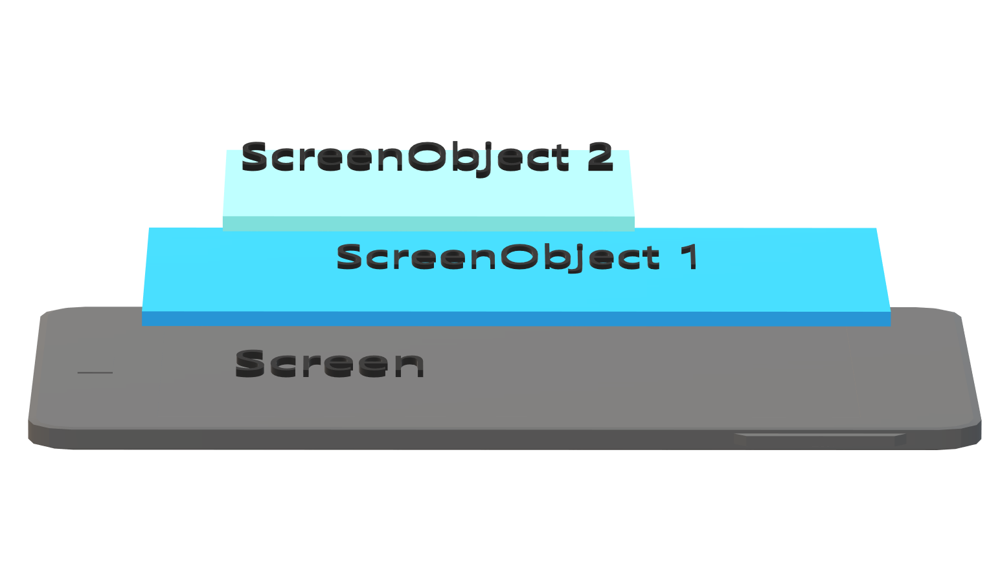
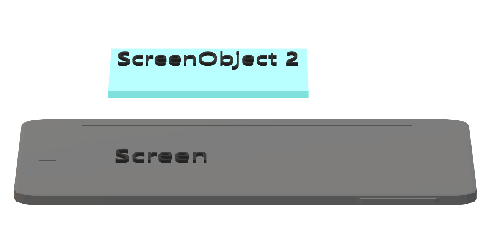

# Python-Screen-Stack-Manager
PSSM - A handy tool to create an image-based user interface with easier layer control.


### What it does
Look at the test file for an example.
When you create a user interface, you often find yourself to be needing an easy to print something on top of what was already there, then remove that thing.
My tool does exactly that.
First, you create a ScreenManagerObject.
Whenever you want to display something, you create a ScreenObject. Then you can add the ScreenObject to the ScreenManagerStack.
What this does, is that it displays the ScreenObject on top of what was previously here.
And what is great, is that you can remove what is under ScreenObject, without removing ScreenObject. You can also update things hidden behind ScreenObject etc...


And the ScreenManager can also handle touch inputs, it serves as a touch driver function. (And the touch driver function can be started as a separate thread if you want to do multiple things at once).
What it does in this case, is that it loops through the stack, the object on the top being the first looked, and it looks if a touch click was made in its area. If so, then it calls the function associated with the ScreenObject.


### Images are worth thousands words
First, create a stackManager object:
`screen = ScreenStackManager(name='Main manager')`

Then, create your screen object: (I am using pillow here).
(You can also create your own ScreenObject without Pillow)
```python
img1 = Image.new('L', (200,800), color=255)
drawImg = ImageDraw.Draw(img1, 'L')
drawImg.rectangle([(0,0),(200,800)],fill=0,outline=50)
obj1 = pillowImgToScreenObject(img1,0,0,"highObj")

img2 = Image.new('L', (800,200), color=255)
drawImg = ImageDraw.Draw(img2, 'L')
drawImg.rectangle([(0,0),(800,200)],fill=200,outline=50)
obj2 = screenStack.pillowImgToScreenObject(img2,0,0,"wideObj")
```

Then, you can display these objects (and a white canvas for instance)
```python
screen.clear()  # Not necessary
screen.refresh()
screen.createCanvas()
screen.addObj(obj1)
screen.addObj(obj2)
```
The output will look like that :

Then, the magic comes in.
You can for instance remove the first object, although is has been printed UNDER obj2!
If you do this:
`screen.removeObj(obj1)`
You get this:



There are a lot more features(like handling the screen inversion and partial inversion, attaching touch events etc...), I will let you dive into the source code for more information.
